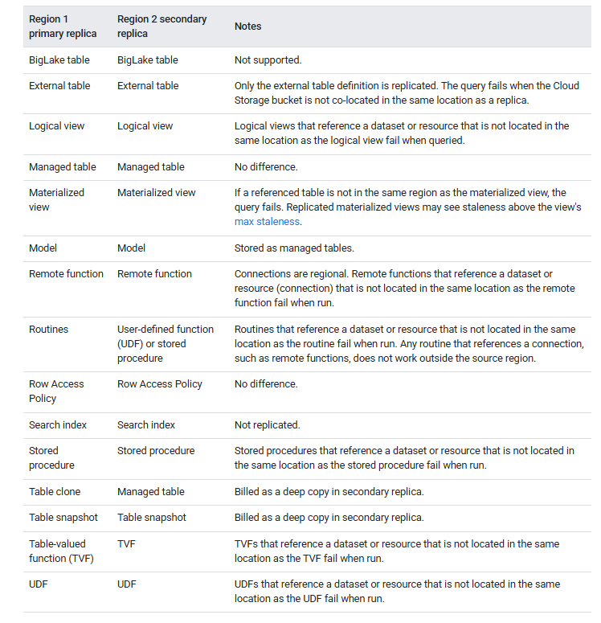
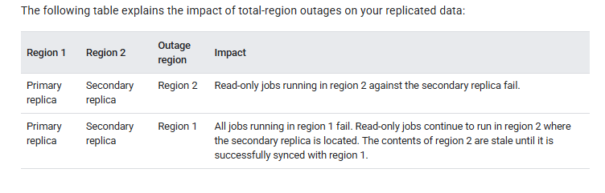
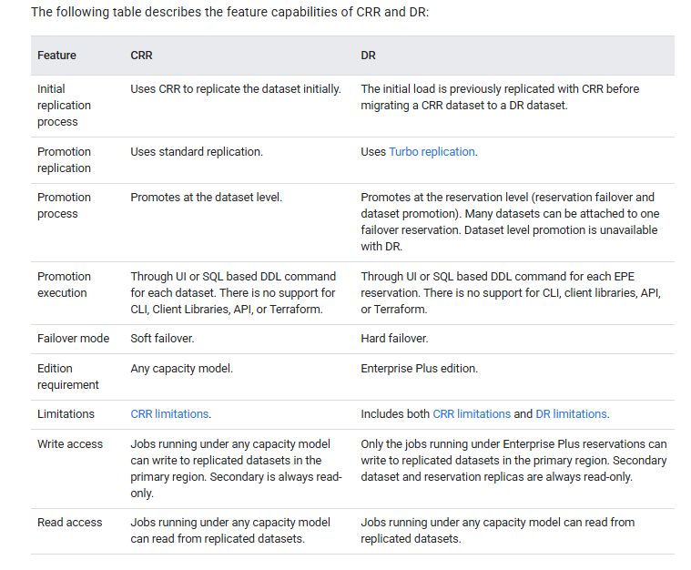
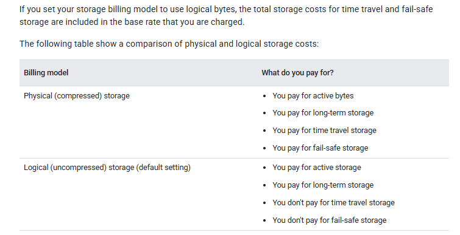

# Bigquery Editions

BigQuery provides three editions which support different types of workloads and the features associated with them. You can enable editions when you reserve BigQuery capacity. 
BigQuery also provides an on-demand (per TiB processed) model. You can choose to use editions and the on-demand model at the same time on a per-project basis

Each edition provides a set of capabilities at a different price point to meet the requirements of different types of organizations. 
You can create a reservation or a capacity commitment associated with an edition. To change the edition associated with a reservation, you must delete and recreate the reservation with the new edition type.

Reservations configured to use slots autoscaling automatically scale to accommodate the demands of their workloads. 
Capacity commitments are not required to purchase slots, but can reduce costs. Because BigQuery editions are a property of compute power, not storage, you can query datasets regardless of how they are stored provided your edition supports the capabilities that you want to use. Slots from all editions are subject to the same quota. Your quota is not fulfilled on a per-edition basis.

# Datasets

A dataset is contained within a specific project. Datasets are top-level containers that are used to organize and control access to your tables and views. 
A table or view must belong to a dataset, so you need to create at least one dataset before loading data into BigQuery.
The location of bigquery dataset cannot be changed after it has been created.

Datasets use time travel in conjunction with the fail-safe period to retain deleted and modified data for a short time, in case you need to recover it.

You can be billed for BigQuery data storage in either logical or physical (compressed) bytes, or a combination of both. 
The storage billing model you choose determines your storage pricing. The storage billing model you choose doesn't impact BigQuery performance. 
Whichever billing model you choose, your data is stored as physical bytes.

You set the storage billing model at the dataset level. 
If you don't specify a storage billing model when you create a dataset, it defaults to using logical storage billing.
Datasets use time travel and fail-safe storage for data retention. 
Time travel and fail-safe storage are charged separately at active storage rates when you use physical storage billing, but are included in the base rate you are charged when you use logical storage billing.

External datasets are also known as federated datasets; both terms are used interchangeably.
Once created, external datasets contain tables from a referenced external data source. Data from these tables aren't copied into BigQuery, but queried every time they are used.

### Limitations
- All tables that are referenced in a query must be stored in datasets in the same location.
- External datasets don't support table expiration, replicas, time travel, default collation, default rounding mode, or the option to enable or disable case-insensitive table names.
- When you copy a table, the datasets that contain the source table and destination table must reside in the same location.
- You can't enroll a dataset in physical storage billing if you have any existing legacy flat-rate slot commitments located in the same region as the dataset.

You can create datasets in the following ways:

- Using the Google Cloud console.
- Using a SQL query.
- Using the bq mk command in the bq command-line tool.
- Calling the datasets.insert API method.
- Using the client libraries.
- Copying an existing dataset.

```python
from google.cloud import bigquery

# Construct a BigQuery client object.
client = bigquery.Client()

# TODO(developer): Set dataset_id to the ID of the dataset to create.
dataset_id = "{}.your_dataset".format(client.project)

# Construct a full Dataset object to send to the API.
dataset = bigquery.Dataset(dataset_id)

# TODO(developer): Specify the geographic location where the dataset should reside.
dataset.location = "US"

# Send the dataset to the API for creation, with an explicit timeout.
# Raises google.api_core.exceptions.Conflict if the Dataset already
# exists within the project.
dataset = client.create_dataset(dataset, timeout=30)  # Make an API request.
print("Created dataset {}.{}".format(client.project, dataset.dataset_id))
```

A hidden dataset is a dataset whose name begins with an underscore. You can query tables and views in hidden datasets the same way you would in any other dataset. Hidden datasets have the following restrictions:

- They are hidden from the Explorer panel in the Google Cloud console.
- They don't appear in any INFORMATION_SCHEMA views.
- They can't be used with linked datasets.
- They can't be used as a source dataset with the following authorized resources:
- - Authorized datasets
- - Authorized routines
- - Authorized views
- They don't appear in Data Catalog (deprecated) or Dataplex Universal Catalog.

With BigQuery dataset replication, you can set up automatic replication of a dataset between two different regions or multi-regions.

BigQuery always stores copies of your data in two different Google Cloud zones within the dataset location. 
A zone is a deployment area for Google Cloud resources within a region. In all regions, replication between zones uses synchronous dual writes. 
Selecting a multi-region location does not provide cross-region replication or regional redundancy, so there is no increase in dataset availability in the event of a regional outage. 
Data is stored in a single region within the geographic location.

For additional geo-redundancy, you can replicate any dataset. BigQuery creates a secondary replica of the dataset, located in another region that you specify. 
This replica is then asynchronously replicated between two zones with the other region, for a total of four zonal copies.

## Dataset replication
If you replicate a dataset, BigQuery stores the data in the region that you specify.

- Primary region. When you first create a dataset, BigQuery places the dataset in the primary region.
- Secondary region. When you add a dataset replica, BigQuery places the replica in the secondary region.

Initially, the replica in the primary region is the primary replica, and the replica in the secondary region is the secondary replica.

The primary replica is writeable, and the secondary replica is read-only. Writes to the primary replica are asynchronously replicated to the secondary replica. 
Within each region, the data is stored redundantly in two zones. Network traffic never leaves the Google Cloud network.



If the primary region is online, you can manually switch to the secondary replica.
You are billed for the following for replicated datasets:
- Storage. Storage bytes in the secondary region are billed as a separate copy in the secondary region. See BigQuery storage pricing.
- Data replication. For more information on how you are billed for data replication, see Data replication pricing.

To run jobs and queries against the replica in the secondary region, you must purchase slots within the secondary region or run an on-demand query.

You can use the slots to perform read-only queries from the secondary replica. If you promote the secondary replica to be the primary, you can also use those slots to write to the replica.

You can purchase the same number of slots as you have in the primary region, or a different number of slots. If you purchase fewer slots, it might affect query performance.

Before adding a dataset replica, you need to create the initial dataset you want to replicate in BigQuery if it doesn't exist already. 
The location of the added replica is set to the location that you specify when adding the replica. 
The location of the added replica must be different from the location of the initial dataset. 
This means that the data in your dataset is continually replicated between the location the dataset was created in and the location of the replica. 
For replicas that require colocation, such as views, materialized views, or non-BigLake external tables, adding a replica in a location that is different from, or not compatible with, your source data's location could result in job errors.

When customers replicate a dataset across regions, BigQuery ensures data is located only in the locations where the replicas were created.

#### Limitations

BigQuery dataset replication is subject to the following limitations:

- Streaming data written to the primary replica from the BigQuery Storage Write API or the tabledata.insertAll method, which is then replicated into the secondary replica, is best-effort and may see high replication delay.
- Streaming upserts written to the primary replica from Datastream or BigQuery change data capture, which is then replicated into the secondary replica, is best-effort and may see high replication delay. Once replicated, the upserts in the secondary replica are merged into the secondary replica's table baseline as per the table's configured max_staleness value.
- You can't enable fine-grained DML on a table in a replicated dataset, and you can't replicate a dataset that contains a table with fine-grained DML enabled.
- Replication and switchover are managed through SQL data definition language (DDL) statements.
- You are limited to one replica of each dataset for each region or multi-region. You cannot create two secondary replicas of the same dataset in the same destination region.
- Resources within replicas are subject to the limitations as described in Resource behavior.
- Policy tags and associated data policies are not replicated to the secondary replica. Any queries that reference columns with policy tags in regions other than the original region fail, even if that replica is promoted.
- Time travel is only available in the secondary replica after the creation of the secondary replica is completed.
- The destination region size limit for enabling cross-region replication on a dataset is 10 PB for us and eu multi-regions and 500 TB for other regions by default. These limits are configurable. For more information, reach out to Google Cloud Support.
- The quota applies to logical resources.
- You can only replicate a dataset with fewer than 100,000 tables.
- You are limited to a maximum of 4 replicas added (then dropped) to the same region per dataset per day.
- You are limited by bandwidth.
- Tables with Customer-managed encryption keys (CMEK) applied are not queryable in the secondary region if the replica_kms_key value is not configured.
- BigLake tables are not supported.
- You can't replicate external or federated datasets.
- BigQuery Omni locations aren't supported.
- You can't configure the following region pairs if you are configuring data replication for disaster recovery:
- us-central1 - us multi-region
- - us-west1 - us multi-region
- - eu-west1 - eu multi-region
- - eu-west4 - eu multi-region
- Routine-level access controls can't be replicated, but you can replicate dataset-level access controls for routines.

The secondary replica is read-only. If you need to create a copy of a resource in a secondary replica, you must either copy the resource or query the resource first, and then materialize the results outside of the secondary replica. 
For example, use CREATE TABLE AS SELECT to create a new resource from the secondary replica resource.

Primary and secondary replicas are subject to the following differences:


Cross-region replication is not intended for use as a disaster recovery plan during a total-region outage. 
In the case of a total region outage in the primary replica's region, you cannot promote the secondary replica. 
Because secondary replicas are read-only, you can't run any write jobs on the secondary replica and can't promote the secondary region until the primary replica's region is restored. 
For more information about preparing for disaster recovery, see Managed disaster recovery.



To replicate a dataset, use the ALTER SCHEMA ADD REPLICA DDL statement.

You can add a replica to any dataset that's located in a region or multi-region that is not already replicated in that region or multi-region. 
After you add a replica, it takes time for the initial copy operation to complete. 
You can still run queries referencing the primary replica while the data is being replicated, with no reduction in query processing capacity. 
You can't replicate data within the geo-locations within a multi-region.

```
-- Create the primary replica in the us-central1 region.
CREATE SCHEMA my_dataset OPTIONS(location='us-central1');

-- Create a replica in the secondary region.
ALTER SCHEMA my_dataset
ADD REPLICA `my_replica`
OPTIONS(location='us-east4');
```

To confirm when the secondary replica has successfully been created, you can query the creation_complete column in the INFORMATION_SCHEMA.SCHEMATA_REPLICAS view.

After the secondary replica has been created, you can query it by explicitly setting the location of the query to the secondary region. 
If a location is not explicitly set, BigQuery uses the region of the primary replica of the dataset.

You can specify the location to run a job explicitly in the following ways:

- When you query data using the Google Cloud console in the query editor, click settings More > Query settings, expand Advanced options, and then select your Data location.
- When you write a SQL query, set the @@location system variable in the first statement of your query.
- When you use the bq command-line tool, supply the --location global flag and set the value to your location.
- When you use the API, specify your region in the location property in the jobReference section of the job resource.

If the primary region is online, you can promote the secondary replica. 
Promotion switches the secondary replica to be the writeable primary. 
This operation completes within a few seconds if the secondary replica is caught up with the primary replica. 
If the secondary replica is not caught up, the promotion can't complete until it is caught up. 
The secondary replica can't be promoted to the primary if the region containing the primary has an outage.

Note the following:

- All writes to tables return errors while promotion is in process. The old primary replica becomes non-writable immediately when the promotion begins.
- Tables that aren't fully replicated at the time the promotion is initiated return stale reads.

```
ALTER SCHEMA my_dataset SET OPTIONS(primary_replica = 'us-east4')
```

To confirm when the secondary replica has successfully been promoted, you can query the replica_primary_assignment_complete column in the INFORMATION_SCHEMA.SCHEMATA_REPLICAS view.

To remove a replica and stop replicating the dataset, use the ALTER SCHEMA DROP REPLICA DDL statement.

```
ALTER SCHEMA my_dataset
DROP REPLICA IF EXISTS `us`;
```

You must first drop any secondary replicas to delete the entire dataset.

Replicas can be used for migrating datasets from one region/multi-region to another ( create secondary replica in new region, promote secondary replica as primary and then delete the old dataset)

```
-- Create a replica in the secondary region.
ALTER SCHEMA my_migration
ADD REPLICA `eu`
OPTIONS(location='eu');

ALTER SCHEMA my_migration SET OPTIONS(primary_replica = 'eu')

ALTER SCHEMA my_migration
DROP REPLICA IF EXISTS us;
```

Customer-managed Cloud Key Management Service keys are not automatically replicated when you create a secondary replica. 
In order to maintain the encryption on your replicated dataset, you must set the replica_kms_key for the location of the added replica. 
You can set the replica_kms_key using the ALTER SCHEMA ADD REPLICA DDL statement.

```
-- Create a replica in the secondary region.
ALTER SCHEMA my_dataset
ADD REPLICA `us-west1`
OPTIONS(location='us-west1',
  replica_kms_key='my_us_west1_kms_key_name');
```

Replicating datasets with CMEK applied are subject to the following limitations:

- You can't update the replicated Cloud KMS key after the replica is created.
- You can't update the default_kms_key value on the source dataset after the dataset replicas have been created.
- If the provided replica_kms_key is not valid in the destination region, the dataset won't be replicated.

## Managed Disaster Recovery

 BigQuery disaster recovery relies on cross-region dataset replication to manage storage failover. 
 After creating a dataset replica in a secondary region, you can control failover behavior for compute and storage to maintain business continuity during an outage. 
 After a failover, you can access compute capacity (slots) and replicated datasets in the promoted region. Disaster recovery is only supported with the Enterprise Plus edition.

Managed disaster recovery offers two failover options: hard failover and soft failover.

A hard failover immediately promotes the secondary region's reservation and dataset replicas to become the primary. 
This action proceeds even if the current primary region is offline and does not wait for the replication of any unreplicated data. 
Because of this, data loss can occur during hard failover. 
Any jobs that committed data in the source region before the replica's value of replication_time may need to be rerun in the destination region after failover.

In contrast to a hard failover, a soft failover waits until all reservation and dataset changes committed in the primary region are replicated to the secondary region before completing the failover process. 
A soft failover requires both the primary and secondary region to be available. Initiating a soft failover sets the softFailoverStartTime for the reservation. The softFailoverStartTime is cleared on soft failover completion.

o enable disaster recovery, you are required to create an Enterprise Plus edition reservation in the primary region, which is the region the dataset is in before failover. 
Standby compute capacity in the paired region is included in the Enterprise Plus reservation. You then attach a dataset to this reservation to enable failover for that dataset. 
You can only attach a dataset to a reservation if the dataset is backfilled and has the same paired primary and secondary locations as the reservation. 
After a dataset is attached to a failover reservation, only Enterprise Plus reservations can write to those datasets and you can't perform a cross-region replication promotion on the dataset.

You must actively choose to fail over as part of testing or in response to a real disaster. 
You shouldn't fail over more than once in a 10-minute window. In data replication scenarios, backfill refers to the process of populating a replica of a dataset with historical data that existed before the replica was created or became active. 
Datasets must complete their backfill before you can fail over to the dataset.

The following limitations apply to BigQuery disaster recovery:

- BigQuery disaster recovery is subject to the same limitations as cross-region dataset replication.
- Autoscaling after a failover depends on compute capacity availability in the secondary region. Only the reservation baseline is available in the secondary region.
- The INFORMATION_SCHEMA.RESERVATIONS view doesn't have failover details.
- If you have multiple failover reservations with the same administration project but whose attached datasets use different secondary locations, don't use one failover reservation with the datasets attached to a different failover reservation.
- If you want to convert an existing reservation to a failover reservation, the existing reservation can't have more than 1,000 reservation assignments.
- A failover reservation can't have more than 1,000 datasets attached to it.
- Soft failover can only be triggered if both the source and destination regions are available.
- Soft failover cannot be triggered if there are any errors transient or otherwise during reservation replication. For example, if there is insufficient slots quota in the secondary region for the reservation update.
- The reservation and attached datasets cannot be updated during an active soft failover but they can still be read from.
- Jobs running on a failover reservation during an active soft failover may not run on the reservation due to transient changes in the dataset and reservation routing during the failover operation. However these jobs will use the reservation slots before any soft failover is initiated and after it completes.

Disaster recovery uses Turbo replication for faster data replication across regions, which reduces the risk of data loss exposure, minimize service downtime, and helps support uninterrupted service following a regional outage.

Turbo replication doesn't apply to the initial backfill operation. 
After the initial backfill operation is completed, turbo replication aims to replicate datasets to a single failover region pair with a secondary replica within 15 minutes, as long as the bandwidth quota isn't exceeded and there are no user errors.
Disaster recovery relies on turbo replication during replication. You are charged based on physical bytes and on a per physical GiB replicated basis.
Storage bytes in the secondary region are billed at the same price as storage bytes in the primary region.
Customers are only required to pay for compute capacity in the primary region. Secondary compute capacity (based on the reservation baseline) is available in the secondary region at no additional cost. Idle slots can't use the secondary compute capacity unless the reservation has failed over.


Managed disaster recovery has a five minute RTO after you initiate a failover. Because of the RTO, capacity is available in the secondary region within five minutes of starting the failover process.

Managed disaster recovery has a RPO that is defined per dataset. The RPO aims to keep the secondary replica within 15 minutes of the primary. To meet this RPO, you can't exceed the bandwidth quota and there can't be any user errors.


BigQuery cross-region replication (CRR) and managed disaster recovery (DR) are both features designed to enhance data availability and disaster recovery capabilities. 
However, they handle regional outages in different ways. CRR doesn't allow promoting the secondary replica if the primary region is unavailable. 
In contrast, DR offers more comprehensive protection by allowing a failover to the secondary replica even if the primary region is unavailable. 
With CRR, only storage is replicated, while with DR both storage and compute capacity are replicated.




Consider the following cost implications when you migrate from CRR to DR:

- DR only supports write access from the Enterprise Plus edition, which incurs higher compute costs. You can read from any capacity model, so read costs for existing jobs don't change.
- DR uses Turbo replication, which incurs additional costs depending on the region pair.
- Storage prices are the same for both CRR and DR.

## Data retention with time travel and fail-safe

You can access changed or deleted data from any point within the time travel window, which covers the past seven days by default. 
Time travel lets you query data that was updated or deleted, restore a table or dataset that was deleted, or restore a table that expired.
You can set the duration of the time travel window, from a minimum of two days to a maximum of seven days.
When modifying a time travel window, if the timestamp specifies a time outside the time travel window, or from before the table was created, then the query fails and returns an error.

When you have a table with multiple columns, the values for each column across all rows are stored together in storage blocks.
When you modify a cell in a BigQuery table, you are changing a specific value within a particular row and a specific column. 
Because BigQuery stores columns together, modifying even a single cell within a column typically requires reading the entire storage block containing that column's data for the affected rows, applying the change, and then writing a new version of that storage block.

BigQuery uses adaptive file sizes and storage blocks. 
The size of storage blocks is not fixed but can vary depending on factors like the size of the table and its data distribution. 
Changing even one cell in a storage block changes the data for that column, potentially affecting many rows. 
Therefore, the unit of data that is versioned and sent to time travel is often the entire storage block that contains the modified data of that column, not just a single cell.
For this reason, changing one cell can result in more data being sent to time travel than just the size of the change.

If you reduce the time travel window duration, delete a table, and then realize that you need a longer period of recoverability for that data, you can create a snapshot of the table from a point in time prior to the table deletion.

BigQuery provides a fail-safe period. During the fail-safe period, deleted data is automatically retained for an additional seven days after the time travel window, so that the data is available for emergency recovery. 
Data is recoverable at the table level. Data is recovered for a table from the point in time represented by the timestamp of when that table was deleted. The fail-safe period is not configurable.

 Time travel and fail-safe storage are charged at the active physical storage rate.
 


Storage costs apply for time travel and fail-safe data, but you are only billed if data storage fees don't apply elsewhere in BigQuery. The following details apply:

- When a table is created, there is no time travel or fail-safe storage cost.
- If data is changed or deleted, then you are charged for the storage of the changed or deleted data saved by time travel during the time travel window and the fail-safe period. This is similar to the storage pricing for table snapshots and clones.

Data retrieval with time travel is subject to the following limitations:

- Time travel only provides access to historical data for the duration of the time travel window. To preserve table data for non-emergency purposes for longer than the time travel window, use table snapshots.
- If a table has, or has previously had, row-level access policies, then time travel can only be used by table administrators. For more information, see Time travel and row-level access.
- Time travel does not restore table metadata.
- Time travel is not supported in the following table types:
- - External tables. However, for Apache Iceberg external tables, you can use the FOR SYSTEM_TIME AS OF clause to access snapshots that are retained in your Iceberg metadata.
- - Temporary cached query result tables.
- - Temporary session tables.
- - Temporary multi-statement tables.
- - Tables listed under external datasets.

