# Tables

The following sections describe the table types that BigQuery supports.

- Standard BigQuery tables: structured data stored in BigQuery storage.
- External tables: tables that reference data stored outside BigQuery.
- Views: logical tables that are created by using a SQL query.

### Standard tables

Standard BigQuery tables contain structured data and are stored in BigQuery storage in a columnar format. 
You can also store references to unstructured data in standard tables by using struct columns that adhere to the ObjectRef format. 
For more information about working with ObjectRef values, see 

BigQuery has the following table types:

- Tables, which have a schema and every column in the schema has a data type.
- Table clones, which are lightweight, writeable copies of BigQuery tables. BigQuery only stores the delta between a table clone and its base table.
- Table snapshots, which are point-in-time copies of tables. They are read-only, but you can restore a table from a table snapshot. 
- - BigQuery stores bytes that are different between a snapshot and its base table, so a table snapshot typically uses less storage than a full copy of the table.

### External Tables

External tables are stored outside out of BigQuery storage and refer to data that's stored outside of BigQuery.

- BigLake tables, which reference structured data stored in data stores such as Cloud Storage, Amazon Simple Storage Service (Amazon S3), and Azure Blob Storage. These tables let you enforce fine-grained security at the table level.
- Object tables, which reference unstructured data stored in data stores such as Cloud Storage.
- Non-BigLake external tables, which reference structured data stored in data stores such as Cloud Storage, Google Drive, and Bigtable. Unlike BigLake tables, these tables don't let you enforce fine-grained security at the table level.

### Views

Views are logical tables that are defined by using a SQL query. These include the following types:

- Views, which are logical tables that are defined by using SQL queries. These queries define the view that is run each time the view is queried.
- Materialized views, which are precomputed views that periodically cache the results of the view query. The cached results are stored in BigQuery storage.

Table can be created with or without schema definition.

You can also restrict data access within tables, by using the following methods:

- 
- 
- 

### Schema

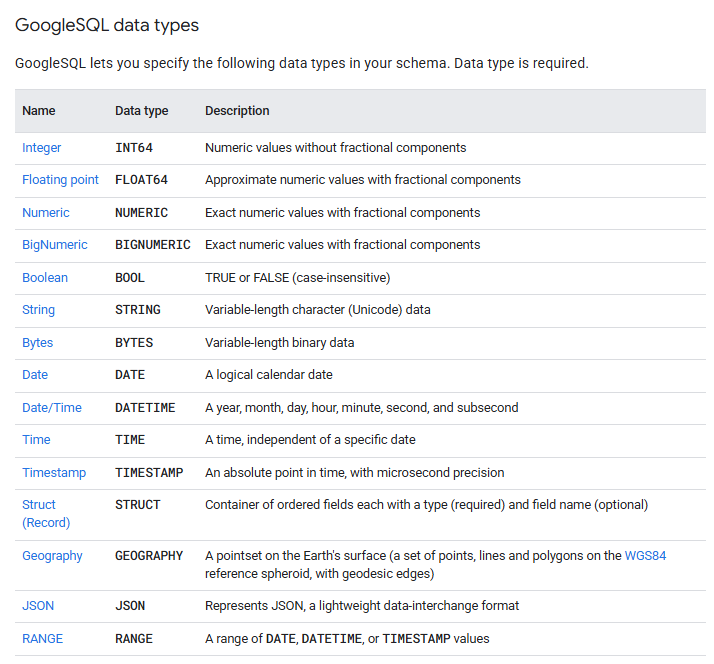

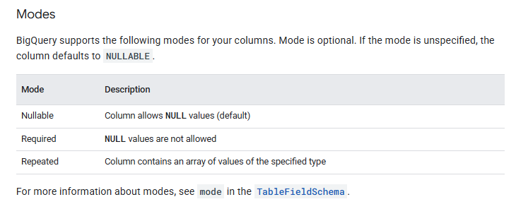

#### Rounding mode
When a column is a NUMERIC or BIGNUMERIC type, you can set the rounding_mode column option, which determines how values in that column are rounded when written to the table. You can set the rounding_mode option on a top-level column or a STRUCT field. The following rounding modes are supported:

- "ROUND_HALF_AWAY_FROM_ZERO": This mode (default) rounds halfway cases away from zero.
- "ROUND_HALF_EVEN": This mode rounds halfway cases towards the nearest even digit.
You cannot set the rounding_mode option for a column that is not a NUMERIC or BIGNUMERIC type. To learn more about these types, see .

When you load data or create an empty table, you can specify the table's schema using the Google Cloud console or the bq command-line tool. Specifying a schema is supported when you load CSV and JSON (newline delimited) files. 
When you load Avro, Parquet, ORC, Firestore export data, or Datastore export data, the schema is automatically retrieved from the self-describing source data.

To create a column with nested data, set the data type of the column to RECORD in the schema. A RECORD can be accessed as a STRUCT type in GoogleSQL. A STRUCT is a container of ordered fields.
To create a column with repeated data, set the mode of the column to REPEATED in the schema. A repeated field can be accessed as an ARRAY type in GoogleSQL.
A RECORD column can have REPEATED mode, which is represented as an array of STRUCT types. 
Also, a field within a record can be repeated, which is represented as a STRUCT that contains an ARRAY. An array cannot contain another array directly. 
For more information, see .

A schema cannot contain more than 15 levels of nested RECORD types.
RECORD type is incompatible with UNION, INTERSECT, EXCEPT DISTINCT, and SELECT DISTINCT.

```sql
CREATE TABLE IF NOT EXISTS mydataset.mytable (
  id STRING,
  first_name STRING,
  last_name STRING,
  dob DATE,
  addresses
    ARRAY<
      STRUCT<
        status STRING,
        address STRING,
        city STRING,
        state STRING,
        zip STRING,
        numberOfYears STRING>>
) OPTIONS (
    description = 'Example name and addresses table');
```

```sql
# Insert Example 1
INSERT INTO mydataset.mytable (id,
first_name,
last_name,
dob,
addresses) values ("1","Johnny","Dawn","1969-01-22",
    ARRAY<
      STRUCT<
        status STRING,
        address STRING,
        city STRING,
        state STRING,
        zip STRING,
        numberOfYears STRING>>
      [("current","123 First Avenue","Seattle","WA","11111","1")])
      
# Insert Example 2
INSERT INTO mydataset.mytable (id,
first_name,
last_name,
dob,
addresses) values ("1","Johnny","Dawn","1969-01-22",[("current","123 First Avenue","Seattle","WA","11111","1")])

# Select Example
SELECT
  first_name,
  last_name,
  addresses[offset(0)].address
FROM
  mydataset.mytable;
  
# To extract all elements of an ARRAY, use the UNNEST operator with a CROSS JOIN.
SELECT
  first_name,
  last_name,
  a.address,
  a.state
FROM
  mydataset.mytable CROSS JOIN UNNEST(addresses) AS a
WHERE
  a.state != 'NY';
```

BigQuery performs best when your data is denormalized. Rather than preserving a relational schema such as a star or snowflake schema, denormalize your data and take advantage of nested and repeated columns. 
Nested and repeated columns can maintain relationships without the performance impact of preserving a relational (normalized) schema.

If the tables are large, it might be resource intensive to join them regularly. Depending on your situation, it might be beneficial to create a single table that contains all the information:

```sql
CREATE TABLE mydataset.denormalized_books(
  title STRING,
  authors ARRAY<STRUCT<id INT64, name STRING, date_of_birth STRING>>,
  num_pages INT64)
AS (
  SELECT
    title,
    ARRAY_AGG(STRUCT(author_id, author_name, date_of_birth)) AS authors,
    ANY_VALUE(num_pages)
  FROM
    mydataset.books,
    UNNEST(author_ids) id
  JOIN
    mydataset.authors
    ON
      id = author_id
  GROUP BY
    title
);
```

The following query uses the row_number() function to identify duplicate records that have the same values for last_name and first_name in the examples used and sorts them by dob:

```sql
CREATE OR REPLACE TABLE mydataset.mytable AS (
  SELECT * except(row_num) FROM (
    SELECT *,
    row_number() over (partition by last_name, first_name order by dob) row_num
    FROM
    mydataset.mytable) temp_table
  WHERE row_num=1
)
```

If a column has type STRUCT, then you must set the default value for the entire STRUCT field. You cannot set the default value for a subset of the fields. The default value for an array cannot be NULL or contain any NULL elements. 

```sql
CREATE TABLE mydataset.complex_table (
  struct_col STRUCT<x STRUCT<x1 TIMESTAMP, x2 NUMERIC>, y ARRAY<DATE>>
    DEFAULT ((CURRENT_TIMESTAMP(), NULL),
             [DATE '2022-01-01', CURRENT_DATE()])
);
```

The Storage Write API only populates default values when the write stream schema is missing a field that is contained in the destination table schema.

You cannot add a new column with a default value to an existing table. However, you can add the column without a default value, then change its default value by using the ALTER COLUMN SET DEFAULT DDL statement.

## Partitioning and Clustering

A partitioned table is divided into segments, called partitions, that make it easier to manage and query your data. 
By dividing a large table into smaller partitions, you can improve query performance and control costs by reducing the number of bytes read by a query. 
You partition tables by specifying a partition column which is used to segment the table.

If a query uses a qualifying filter on the value of the partitioning column, BigQuery can scan the partitions that match the filter and skip the remaining partitions. This process is called pruning.

In BigQuery, a clustered column is a user-defined table property that sorts storage blocks based on the values in the clustered columns. The storage blocks are adaptively sized based on the size of the table.
A clustered table maintains the sort properties in the context of each operation that modifies it. 
Queries that filter or aggregate by the clustered columns only scan the relevant blocks based on the clustered columns, instead of the entire table or table partition. 
As a result, BigQuery might not be able to accurately estimate the bytes to be processed by the query or the query costs, but it attempts to reduce the total bytes at execution.
When you cluster a table using multiple columns, the column order determines which columns take precedence when BigQuery sorts and groups the data into storage blocks


Clustering addresses how a table is stored so it's generally a good first option for improving query performance. 
You should therefore always consider clustering given the following advantages it provides:

- Unpartitioned tables larger than 64 MB are likely to benefit from clustering. Similarly, table partitions larger than 64 MB are also likely to benefit from clustering. Clustering smaller tables or partitions is possible, but the performance improvement is usually negligible.
- If your queries commonly filter on particular columns, clustering accelerates queries because the query only scans the blocks that match the filter.
- If your queries filter on columns that have many distinct values (high cardinality), clustering accelerates these queries by providing BigQuery with detailed metadata for where to get input data.
- Clustering enables your table's underlying storage blocks to be adaptively sized based on the size of the table.

You might consider partitioning your table in addition to clustering. 
In this approach, you first segment data into partitions, and then you cluster the data within each partition by the clustering columns. Consider this approach in the following circumstances:

- You need a strict query cost estimate before you run a query. The cost of queries over clustered tables can only be determined after the query is run. Partitioning provides granular query cost estimates before you run a query.
- Partitioning your table results in an average partition size of at least 10 GB per partition. Creating many small partitions increases the table's metadata, and can affect metadata access times when querying the table.
- You need to continually update your table but still want to take advantage of long-term storage pricing. Partitioning enables each partition to be considered separately for eligibility for long term pricing. If your table is not partitioned, then your entire table must not be edited for 90 consecutive days to be considered for long term pricing.

Clustered tables can help you to reduce query costs by pruning data so it's not processed by the query. 
This process is called block pruning. BigQuery sorts the data in a clustered table based on the values in the clustering columns and organizes them into blocks.

When you run a query against a clustered table, and the query includes a filter on the clustered columns, BigQuery uses the filter expression and the block metadata to prune the blocks scanned by the query. This allows BigQuery to scan only the relevant blocks.

When a block is pruned, it is not scanned. Only the scanned blocks are used to calculate the bytes of data processed by the query. The number of bytes processed by a query against a clustered table equals the sum of the bytes read in each column referenced by the query in the scanned blocks.

In a partitioned table, data is stored in physical blocks, each of which holds one partition of data. Each partitioned table maintains various metadata about the sort properties across all operations that modify it. The metadata lets BigQuery more accurately estimate a query cost before the query is run. 
However, partitioning requires BigQuery to maintain more metadata than with an unpartitioned table. As the number of partitions increases, the amount of metadata to maintain increases.

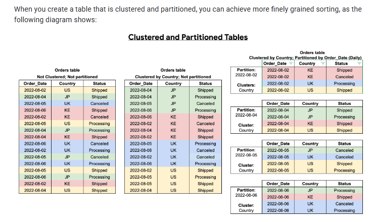

### Clustering limitations

- Only GoogleSQL is supported for querying clustered tables and for writing query results to clustered tables.
- You can only specify up to four clustering columns. If you need additional columns, consider combining clustering with partitioning.
- When using STRING type columns for clustering, BigQuery uses only the first 1,024 characters to cluster the data. The values in the columns can themselves be longer than 1,024 characters.
- If you alter an existing non-clustered table to be clustered, the existing data is not automatically clustered. Only new data that's stored using the clustered columns is subject to automatic reclustering. For more information about reclustering existing data using an UPDATE statement, see .

With clustered tables, table data is organized based on the values of specified columns, also called the clustering columns. 
BigQuery sorts the data by the clustered columns, then stores the rows that have similar values in the same or nearby physical blocks. 
When a query filters on a clustered column, BigQuery efficiently scans only the relevant blocks and skips the data that doesn't match the filter.

Clustering columns must be top-level, non-repeated columns, and they must be one of the following data types:

BIGNUMERIC
BOOL
DATE
DATETIME
GEOGRAPHY
INT64
NUMERIC
RANGE
STRING
TIMESTAMP


```sql
CREATE TABLE mydataset.myclusteredtable
(
  customer_id STRING,
  transaction_amount NUMERIC
)
CLUSTER BY
  customer_id
  OPTIONS (
    description = 'a table clustered by customer_id');
    
LOAD DATA INTO mydataset.mytable
PARTITION BY transaction_date
CLUSTER BY customer_id
  OPTIONS (
    partition_expiration_days = 3)
FROM FILES(
  format = 'AVRO',
  uris = ['gs://bucket/path/file.avro']);
```

When you submit a query that contains a filter on a clustered column, BigQuery uses the clustering information to efficiently determine whether a block contains any data relevant to the query. This allows BigQuery to only scan the relevant blocks — a process referred to as block pruning.
To get the benefits of clustering, include one or more of the clustered columns in left-to-right sort order, starting with the first column. 
In most cases, the first clustering column is the most effective in block pruning, then the second column, then the third. 
You can still use the second or third column alone in the query, but block pruning probably won't be as effective. 
The ordering of the column names inside the filter expression doesn't affect performance.

```sql
CREATE TABLE
  `mydataset.ClusteredSalesData`
PARTITION BY
  DATE(timestamp)
CLUSTER BY
  customer_id,
  product_id,
  order_id AS
SELECT
  *
FROM
  `mydataset.SalesData`
  
# The query includes a filter expression that filters on customer_id and then on product_id. 
# This query optimizes performance by filtering the clustered columns in sort order—the column order given in the CLUSTER BY clause.
SELECT
  SUM(totalSale)
FROM
  `mydataset.ClusteredSalesData`
WHERE
  customer_id = 10000
  AND product_id LIKE 'gcp_analytics%'
  
# The following query does not filter the clustered columns in sort order. 
# As a result, the performance of the query is not optimal. This query filters on product_id then on order_id (skipping customer_id).

SELECT
  SUM(totalSale)
FROM
  `mydataset.ClusteredSalesData`
WHERE
  product_id LIKE 'gcp_analytics%'
  AND order_id = 20000
```

If you use a clustered column in a complex filter expression, the performance of the query is not optimized because block pruning cannot be applied.

```sql
# For example, the following query won't prune blocks because a clustered column—customer_id—is used in a function in the filter expression.
SELECT
  SUM(totalSale)
FROM
  `mydataset.ClusteredSalesData`
WHERE
  CAST(customer_id AS STRING) = "10000"
  
# To optimize query performance by pruning blocks, use simple filter expressions like the following. In this example, a simple filter is applied to the clustered column—customer_id.
SELECT
  SUM(totalSale)
FROM
  `mydataset.ClusteredSalesData`
WHERE
  customer_id = 10000
  
# The following query does not prune blocks because the filter expression compares a clustered column—customer_id to another column—order_id.
SELECT
  SUM(totalSale)
FROM
  `mydataset.ClusteredSalesData`
WHERE
  customer_id = order_id
```

If a filter expression compares a clustered column to another column (either a clustered column or a non-clustered column), the performance of the query is not optimized because block pruning cannot be applied.

Consider partitioning a table in the following scenarios:

- You want to improve the query performance by only scanning a portion of a table.
- Your table operation exceeds a standard table quota and you can scope the table operations to specific partition column values allowing higher partitioned table quotas.
- You want to determine query costs before a query runs. BigQuery provides query cost estimates before the query is run on a partitioned table. Calculate a query cost estimate by pruning a partitioned table, then issuing a query dry run to estimate query costs.
- You want any of the following partition-level management features:
- - Set a partition expiration time to automatically delete entire partitions after a specified period of time.
- - Write data to a specific partition using load jobs without affecting other partitions in the table.
- - Delete specific partitions without scanning the entire table.

Consider clustering a table instead of partitioning a table in the following circumstances:

- You need more granularity than partitioning allows.
- Your queries commonly use filters or aggregation against multiple columns.
- The cardinality of the number of values in a column or group of columns is large.
- You don't need strict cost estimates before query execution.
- Partitioning results in a small amount of data per partition (approximately less than 10 GB). Creating many small partitions increases the table's metadata, and can affect metadata access times when querying the table.
- Partitioning results in a large number of partitions, exceeding the limits on partitioned tables.
- Your DML operations frequently modify (for example, every few minutes) most partitions in the table.

In such cases, table clustering lets you accelerate queries by clustering data in specific columns based on user-defined sort properties.

You can get information about partitioned tables in the following ways:

- Use the INFORMATION_SCHEMA.PARTITIONS view (Preview).
- Use the __PARTITIONS_SUMMARY__ meta-table (legacy SQL only).

```sql
# create empty parttioned tables
CREATE TABLE
  mydataset.newtable (transaction_id INT64, transaction_date DATE)
PARTITION BY
  transaction_date
  OPTIONS (
    partition_expiration_days = 3,
    require_partition_filter = TRUE);
    
    
# create parttioned tables from query result

CREATE TABLE
  mydataset.newtable (transaction_id INT64, transaction_date DATE)
PARTITION BY
  transaction_date
AS (
  SELECT
    transaction_id, transaction_date
  FROM
    mydataset.mytable
);
```

If a query uses a qualifying filter on the value of the partitioning column, BigQuery can scan the partitions that match the filter and skip the remaining partitions. This process is called partition pruning.

```sql
SELECT
  column
FROM
  dataset.table
WHERE
  _PARTITIONTIME BETWEEN TIMESTAMP('2016-01-01') AND TIMESTAMP('2016-01-02')
```

To improve query performance, use the _PARTITIONTIME pseudocolumn by itself on the left side of a comparison.
```sql
-- Might be slower.
SELECT
  field1
FROM
  dataset.table1
WHERE
  TIMESTAMP_ADD(_PARTITIONTIME, INTERVAL 5 DAY) > TIMESTAMP("2016-04-15");

-- Often performs better.
SELECT
  field1
FROM
  dataset.table1
WHERE
  _PARTITIONTIME > TIMESTAMP_SUB(TIMESTAMP('2016-04-15'), INTERVAL 5 DAY);
```

```sql
SELECT
  column
FROM
  dataset.table2
WHERE
  -- This filter condition limits the scanned partitions:
  _PARTITIONTIME BETWEEN TIMESTAMP('2017-01-01') AND TIMESTAMP('2017-03-01')
  -- This one doesn't, because it uses dynamic table values:
  AND _PARTITIONTIME = (SELECT MAX(timestamp) from dataset.table1)
  
-- Scans all partitions of table2. No pruning.
SELECT
  field1
FROM
  dataset.table2
WHERE
  _PARTITIONTIME + field1 = TIMESTAMP('2016-03-28');
  
-- This view provides pruning.
CREATE VIEW dataset.past_week AS
  SELECT *
  FROM
    dataset.partitioned_table
  WHERE _PARTITIONTIME BETWEEN
    TIMESTAMP_TRUNC(TIMESTAMP_SUB(CURRENT_TIMESTAMP, INTERVAL 7 * 24 HOUR), DAY)
    AND TIMESTAMP_TRUNC(CURRENT_TIMESTAMP, DAY);
```

The __UNPARTITIONED__ partition temporarily holds data that is streamed to a partitioned table while it is in the write-optimized storage. 
Data that is streamed directly to a specific partition of a partitioned table does not use the __UNPARTITIONED__ partition. Instead, the data is streamed directly to the partition.

## Types of partitioning

### Integer range partitioning

```sql
CREATE TABLE mydataset.newtable (customer_id INT64, date1 DATE)
PARTITION BY
  RANGE_BUCKET(customer_id, GENERATE_ARRAY(0, 100, 10))
  OPTIONS (
    require_partition_filter = TRUE);
```

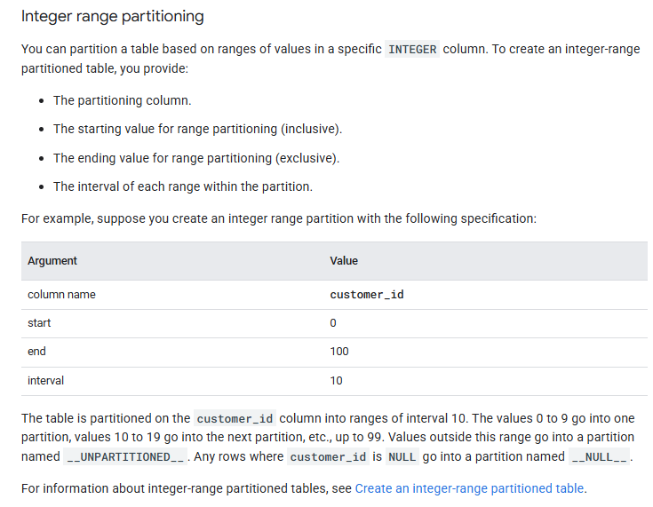

### Time-unit column partitioning

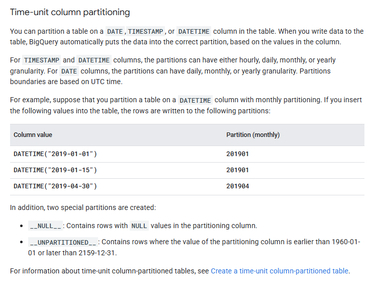

### Ingestion-time partitioning

```sql
CREATE TABLE
  mydataset.newtable (transaction_id INT64)
PARTITION BY
  _PARTITIONDATE
  OPTIONS (
    partition_expiration_days = 3,
    require_partition_filter = TRUE);
```

When you create a table partitioned by ingestion time, BigQuery automatically assigns rows to partitions based on the time when BigQuery ingests the data. 
You can choose hourly, daily, monthly, or yearly granularity for the partitions. Partitions boundaries are based on UTC time.

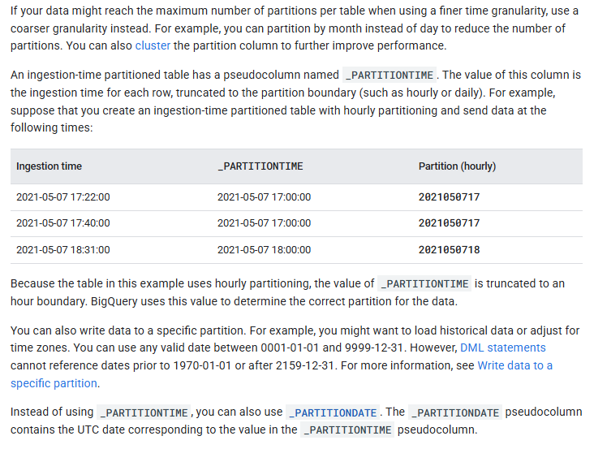


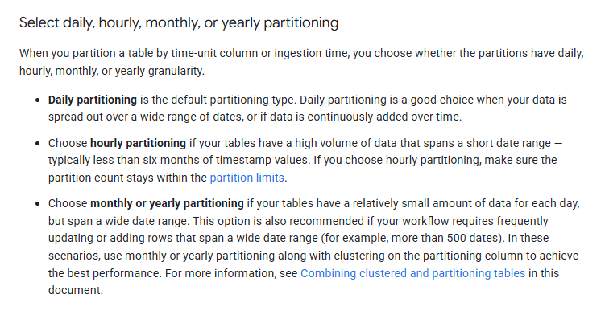

When you create a table partitioned by ingestion time or time-unit column, you can specify a partition expiration. 
This setting specifies how long BigQuery keeps the data in each partition. The setting applies to all partitions in the table, but is calculated independently for each partition based on the partition time.

A clustered table contains clustered columns that sort data based on user-defined sort properties. 
Data within these clustered columns are sorted into storage blocks which are adaptively sized based on the size of the table. 
When you run a query that filters by the clustered column, BigQuery only scans the relevant blocks based on the clustered columns instead of the entire table or table partition. 
In a combined approach using both table partitioning and clustering, you first segment table data into partitions, then you cluster the data within each partition by the clustering columns.

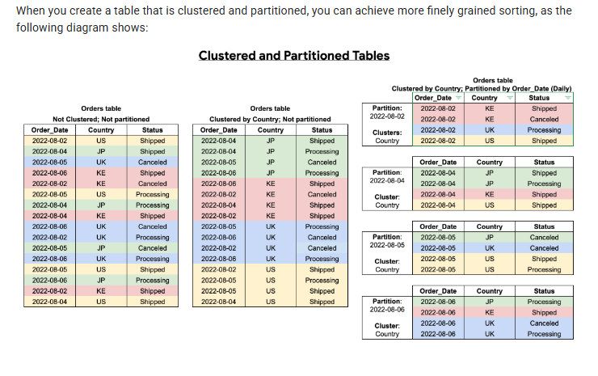

Table sharding is the practice of storing data in multiple tables, using a naming prefix such as [PREFIX]_YYYYMMDD.

Partitioning is recommended over table sharding, because partitioned tables perform better. 
With sharded tables, BigQuery must maintain a copy of the schema and metadata for each table. 
BigQuery might also need to verify permissions for each queried table. This practice also adds to query overhead and affects query performance.

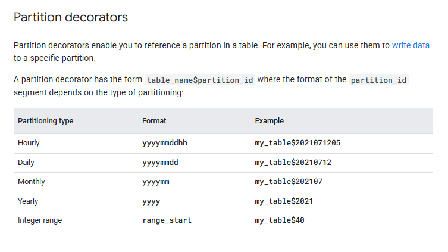

Exporting all data from a partitioned table is the same process as exporting data from a non-partitioned table.
To export data from an individual partition, use the bq extract command and append the partition decorator to the table name. 
For example, my_table$20160201. You can also export data from the __NULL__ and __UNPARTITIONED__ partitions by appending the partition names to the table name. For example, my_table$__NULL__ or my_table$__UNPARTITIONED__.

When you create a table partitioned by ingestion time or time-unit column, you can specify a partition expiration.
If you set a table expiration, that value takes precedence over the partition expiration.
When a partition expires, BigQuery deletes that partition. The partition data is retained in accordance with time travel and fail-safe policies, and can be charged for, depending on your billing model.
If a partitioned table has the Require partition filter setting, then every query on that table must include at least one predicate that only references the partitioning column.

```sql
ALTER TABLE mydataset.mypartitionedtable
  SET OPTIONS (
    require_partition_filter = true);
```


### Limitations
- BigQuery does not support partitioning by multiple columns. Only one column can be used to partition a table
- You cannot directly convert an existing non-partitioned table to a partitioned table. The partitioning strategy is defined when the table is created. Instead, use the CREATE TABLE statement to create a new partitioned table by querying the data in the existing table.
- Time-unit column-partitioned tables are subject to the following limitations:
- - The partitioning column must be either a scalar DATE, TIMESTAMP, or DATETIME column. While the mode of the column can be REQUIRED or NULLABLE, it cannot be REPEATED (array-based).
- - The partitioning column must be a top-level field. You cannot use a leaf field from a RECORD (STRUCT) as the partitioning column.
- Integer-range partitioned tables are subject to the following limitations:
- - The partitioning column must be an INTEGER column. While the mode of the column may be REQUIRED or NULLABLE, it cannot beREPEATED (array-based).
- - The partitioning column must be a top-level field. You cannot use a leaf field from a RECORD (STRUCT) as the partitioning column.


BigQuery automatically indexes metadata for BigQuery tables exceeding 1 GiB. This metadata includes file location, partitioning information, and column-level attributes, which BigQuery uses to optimize and accelerate your queries.
By default, metadata indexing in BigQuery is a free background operation and requires no action on your part. However, index freshness depends on available free resources and doesn't have performance service level objectives (SLOs). If index freshness is critical for your use case, we recommend configuring a BACKGROUND reservation.


## External tables


## Biglake Iceberg tables

BigLake tables for Apache Iceberg in BigQuery, (hereafter, BigLake Iceberg tables in BigQuery) provide the foundation for building open-format lakehouses on Google Cloud. 
BigLake Iceberg tables in BigQuery offer the same fully managed experience as standard BigQuery tables, but store data in customer-owned storage buckets. 
BigLake Iceberg tables in BigQuery support the open Iceberg table format for better interoperability with open-source and third-party compute engines on a single copy of data.

BigLake tables for Apache Iceberg in BigQuery are distinct from . 
BigLake tables for Apache Iceberg in BigQuery are fully managed tables that are modifiable directly in BigQuery, while Apache Iceberg external tables are customer-managed and offer read-only access from BigQuery.

BigLake Iceberg tables in BigQuery utilize  as the unified runtime metastore for all Iceberg data. 
BigLake metastore provides a single source of truth for managing metadata from multiple engines and allows for engine interoperability.

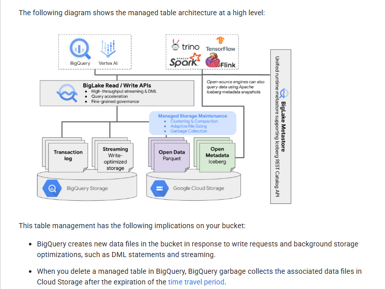

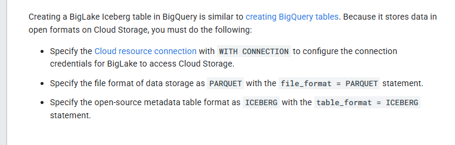

Directly changing or adding files to the bucket outside of BigQuery can lead to data loss or unrecoverable errors.

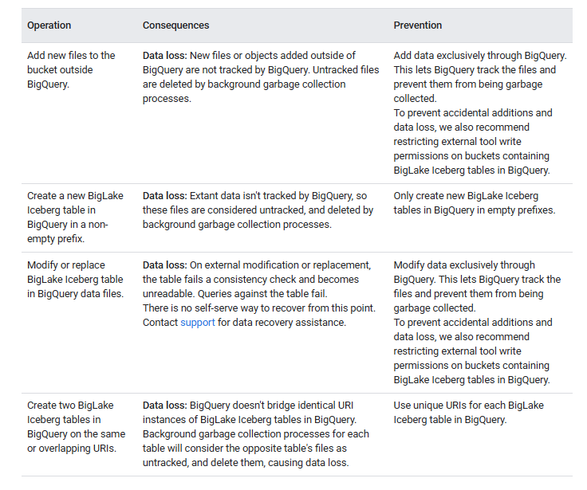

By default, Cloud Storage stores data in the Standard storage class, which provides sufficient performance. To optimize data storage costs, you can enable Autoclass to automatically manage storage class transitions. 
Autoclass starts with the Standard storage class and moves objects that aren't accessed to progressively colder classes in order to reduce storage costs. When the object is read again, it's moved back to the Standard class.

BigLake Iceberg tables in BigQuery use BigQuery load jobs to load external files into BigLake Iceberg tables in BigQuery.

BigLake Iceberg tables in BigQuery store all data in Cloud Storage. You are charged for all data stored, including historical table data. 
Cloud Storage data processing and transfer charges might also apply. Some Cloud Storage operation fees might be waived for operations that are processed through BigQuery or the BigQuery Storage API. There are no BigQuery-specific storage fees

BigLake Iceberg tables in BigQuery perform automatic table management, including compaction, clustering, garbage collection, and BigQuery metadata generation/refresh to optimize query performance and reduce storage costs. 
Compute resource usage for BigLake table management is billed in Data Compute Units (DCUs) over time, in per second increments.

The INFORMATION_SCHEMA.TABLE_STORAGE view doesn't include BigLake Iceberg tables in BigQuery.

Only one concurrent mutating DML statement (UPDATE, DELETE, and MERGE) runs for each BigLake Iceberg table in BigQuery. Additional mutating DML statements are queued.

BigLake Iceberg tables in BigQuery support the following features:

- Table mutations using GoogleSQL data manipulation language (DML).
- Unified batch and high throughput streaming using the Storage Write API through BigLake connectors like Spark, Dataflow, and other engines.
- Iceberg V2 snapshot export and automatic refresh on each table mutation for direct query access with open-source and third-party query engines.
- Schema evolution, which lets you add, drop, and rename columns to suit your needs. This feature also lets you change an existing column's data type and column mode. For more information, see type conversion rules.
- Automatic storage optimization, including adaptive file sizing, automatic clustering, garbage collection, and metadata optimization.
- Time travel for historical data access in BigQuery.
- Column-level security and data masking.
- Multi-statement transactions (in Preview).


## INFORMATION SCHEMA views

INFORMATION_SCHEMA is a series of views that provide access to metadata about datasets, routines, tables, views, jobs, reservations, and streaming data.

You can query the following views to get table information:

- Use the INFORMATION_SCHEMA.TABLES and INFORMATION_SCHEMA.TABLE_OPTIONS views to retrieve metadata about tables and views in a project.
- Use the INFORMATION_SCHEMA.COLUMNS and INFORMATION_SCHEMA.COLUMN_FIELD_PATHS views to retrieve metadata about the columns (fields) in a table.
- Use the INFORMATION_SCHEMA.TABLE_STORAGE views to retrieve metadata about current and historical storage usage by a table.
The TABLES and TABLE_OPTIONS views also contain high-level information about views. For detailed information, query the INFORMATION_SCHEMA.VIEWS view instead.

The following example shows you the total logical bytes billed for the current project.

```sql
SELECT
  SUM(total_logical_bytes) AS total_logical_bytes
FROM
  `region-REGION`.INFORMATION_SCHEMA.TABLE_STORAGE;
```

The following example shows different storage bytes in GiB at the dataset(s) level for current project.

```sql
SELECT
  table_schema AS dataset_name,
  -- Logical
  SUM(total_logical_bytes) / power(1024, 3) AS total_logical_gib,  
  SUM(active_logical_bytes) / power(1024, 3) AS active_logical_gib, 
  SUM(long_term_logical_bytes) / power(1024, 3) AS long_term_logical_gib, 
  -- Physical
  SUM(total_physical_bytes) / power(1024, 3) AS total_physical_gib,
  SUM(active_physical_bytes) / power(1024, 3) AS active_physical_gib,
  SUM(active_physical_bytes - time_travel_physical_bytes) / power(1024, 3) AS active_no_tt_physical_gib,
  SUM(long_term_physical_bytes) / power(1024, 3) AS long_term_physical_gib,
  SUM(time_travel_physical_bytes) / power(1024, 3) AS time_travel_physical_gib,
  SUM(fail_safe_physical_bytes) / power(1024, 3) AS fail_safe_physical_gib 
FROM
  `region-REGION`.INFORMATION_SCHEMA.TABLE_STORAGE 
WHERE 
  table_type ='BASE TABLE'
GROUP BY 
  table_schema  
ORDER BY 
  dataset_name 
```

The following example shows you how to forecast the price difference per dataset between logical and physical billing models for the next 30 days.

```sql
DECLARE active_logical_gib_price FLOAT64 DEFAULT 0.02;
DECLARE long_term_logical_gib_price FLOAT64 DEFAULT 0.01;
DECLARE active_physical_gib_price FLOAT64 DEFAULT 0.04;
DECLARE long_term_physical_gib_price FLOAT64 DEFAULT 0.02;

WITH
 storage_sizes AS (
   SELECT
     table_schema AS dataset_name,
     -- Logical
     SUM(IF(deleted=false, active_logical_bytes, 0)) / power(1024, 3) AS active_logical_gib,
     SUM(IF(deleted=false, long_term_logical_bytes, 0)) / power(1024, 3) AS long_term_logical_gib,
     -- Physical
     SUM(active_physical_bytes) / power(1024, 3) AS active_physical_gib,
     SUM(active_physical_bytes - time_travel_physical_bytes) / power(1024, 3) AS active_no_tt_physical_gib,
     SUM(long_term_physical_bytes) / power(1024, 3) AS long_term_physical_gib,
     -- Restorable previously deleted physical
     SUM(time_travel_physical_bytes) / power(1024, 3) AS time_travel_physical_gib,
     SUM(fail_safe_physical_bytes) / power(1024, 3) AS fail_safe_physical_gib,
   FROM
     `region-REGION`.INFORMATION_SCHEMA.TABLE_STORAGE_BY_PROJECT
   WHERE total_physical_bytes + fail_safe_physical_bytes > 0
     -- Base the forecast on base tables only for highest precision results
     AND table_type  = 'BASE TABLE'
     GROUP BY 1
 )
SELECT
  dataset_name,
  -- Logical
  ROUND(active_logical_gib, 2) AS active_logical_gib,
  ROUND(long_term_logical_gib, 2) AS long_term_logical_gib,
  -- Physical
  ROUND(active_physical_gib, 2) AS active_physical_gib,
  ROUND(long_term_physical_gib, 2) AS long_term_physical_gib,
  ROUND(time_travel_physical_gib, 2) AS time_travel_physical_gib,
  ROUND(fail_safe_physical_gib, 2) AS fail_safe_physical_gib,
  -- Compression ratio
  ROUND(SAFE_DIVIDE(active_logical_gib, active_no_tt_physical_gib), 2) AS active_compression_ratio,
  ROUND(SAFE_DIVIDE(long_term_logical_gib, long_term_physical_gib), 2) AS long_term_compression_ratio,
  -- Forecast costs logical
  ROUND(active_logical_gib * active_logical_gib_price, 2) AS forecast_active_logical_cost,
  ROUND(long_term_logical_gib * long_term_logical_gib_price, 2) AS forecast_long_term_logical_cost,
  -- Forecast costs physical
  ROUND((active_no_tt_physical_gib + time_travel_physical_gib + fail_safe_physical_gib) * active_physical_gib_price, 2) AS forecast_active_physical_cost,
  ROUND(long_term_physical_gib * long_term_physical_gib_price, 2) AS forecast_long_term_physical_cost,
  -- Forecast costs total
  ROUND(((active_logical_gib * active_logical_gib_price) + (long_term_logical_gib * long_term_logical_gib_price)) -
     (((active_no_tt_physical_gib + time_travel_physical_gib + fail_safe_physical_gib) * active_physical_gib_price) + (long_term_physical_gib * long_term_physical_gib_price)), 2) AS forecast_total_cost_difference
FROM
  storage_sizes
ORDER BY
  (forecast_active_logical_cost + forecast_active_physical_cost) DESC;
```